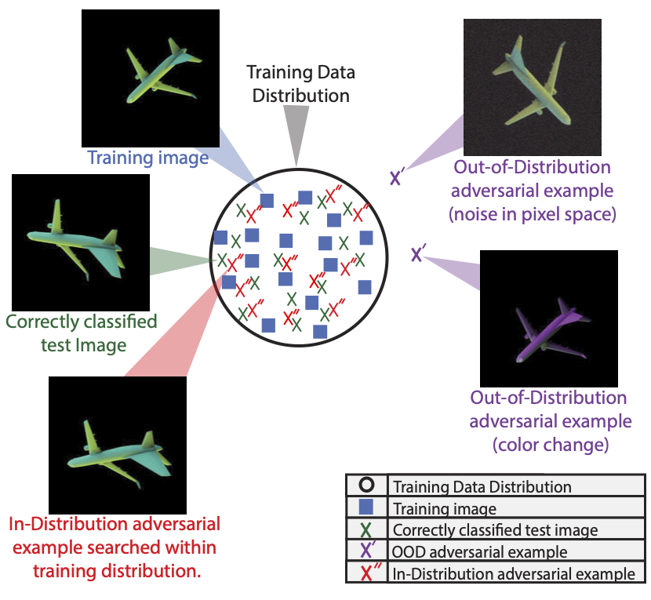

<div align="center">
<h3>Adversarial examples within the training distribution: A widespread challenge.</h3>
  
  
  <a href="#overview">Overview</a> •
  <a href="#demos">Demos</a> •
  <a href="#codebase">Using the Codebase</a> •
  <a href="#data">Accessing the data</a> •
</div>

This repository contains the codebase for our TMLR submission: *Adversarial examples within the training distribution: A widespread challenge.* Here you can find the code, demos and the data used for this project.

# Overview
Despite a plethora of proposed theories, understanding why deep neural networks are susceptible to adversarial attacks remains an open question. A promising recent strand of research investigates adversarial attacks within the training data distribution, providing a more stringent and worrisome definition for these attacks. These theories posit that the key issue is that in high dimensional datasets, most data points are close to the ground-truth class boundaries. This has been shown in theory for some simple data distributions, but it is unclear if this theory is relevant in practice. Here, we demonstrate the existence of in-distribution adversarial examples for object recognition. This result provides evidence supporting theories attributing adversarial examples to the proximity of data to ground-truth class boundaries, and calls into question other theories which do not account for this more stringent definition of adversarial attacks. These experiments are enabled by our novel gradient-free, evolutionary strategies (ES) based approach for finding in-distribution adversarial examples in 3D rendered objects, which we call CMA-Search.

# Demos
We provide three demos to reproduce our main findings on in-distribution adversarial examples, one for each level of data complexity we investigate in our paper:-

1. Simplistic parametrically controlled data sampled from disjoint per-category uniform distributions:
 
2. Parametric and controlled images of objects using our graphics pipeline: 
 
3. Natural image data from the ImageNet dataset:

# Codebase

Our work builds on three existing pipelines---[Redner](https://github.com/BachiLi/redner) for rendering images, [PyCMA] (https://github.com/CMA-ES/pycma) for running the CMA-ES search algorithm, and [Single view MPI](https://github.com/google-research/google-research/tree/master/single_view_mpi) for generating novel views with ImageNet. Each of these libraries were modified from their original versions to adapt them for searching in-distribution adversarial examples with *CMA-Search*, which we propose in our work. Thus, we provide the adapted versions with this codebase in the folders `redner`, `cma` and `single_view_mpi` respectively.

### Code Structure

`rendering`: Contains scripts for our computer graphics pipeline to render ShapeNet objects under lighting and viewpoint variations.

`training_models`: Contains scripts and notebooks for training our visual recognition models.

`other_optimization_methods`: Contains scripts and notebooks for attacking trained models using *CMA-Search*.

`demos`: Contains demos covering every aspect of training models, and attacking them using *CMA-Search* mentioned above.

The best entry point to explore this code base would be to start from `demos` to understand the results, and explore how the rest of the code is used to reproduce the results in the paper.

### System Requirements

Experiments were conducted on clusters with the SLURM workload manager. Machine architectures are as follows:

- Operating System: CentOS Linux 7 (Core)
- CPE OS Name: cpe:/o:centos:centos:7
- Kernel: Linux 3.10.0-1062.el7.x86_64
- Architecture: x86-64

The code should work out of the box on most linux distributions. The code was not tested on MacOS, or any other linux distribution except CentOS Linux 7 (Core). Code was run using Python 3.8.5. Exact version numbers for python pacakges can be found in the `in_dist_requirements.txt` file. GPUs will be needed to accelerate training and inference time. 

### Installation
- Clone this github repository.
- Install the required python packages using `pip` in accordance with the `in_dist_requirements.txt` file. This includes all package names and versions used in our analysis.
- Download the data (not needed to run demos) following instructions below.
       
Data download, installation and setup combined should take less than 30 minutes to an hour.
###

# Data
The dataset with ShapeNet models rendered under camera and lighting variations can be accessed here: https://drive.google.com/file/d/1yY9jwHz80fTtPSL6Y86xWQOr7Uwzq-EU/view?usp=share_link. It can be downloaded programmatically using the following command:

```wget --load-cookies /tmp/cookies.txt "https://docs.google.com/uc?export=download&confirm=$(wget --quiet --save-cookies /tmp/cookies.txt --keep-session-cookies --no-check-certificate 'https://docs.google.com/uc?export=download&id=1yY9jwHz80fTtPSL6Y86xWQOr7Uwzq-EU' -O- | sed -rn 's/.*confirm=([0-9A-Za-z_]+).*/\1\n/p')&id=1yY9jwHz80fTtPSL6Y86xWQOr7Uwzq-EU" -O shapenet_camera_light.zip && rm -rf /tmp/cookies.txt```
